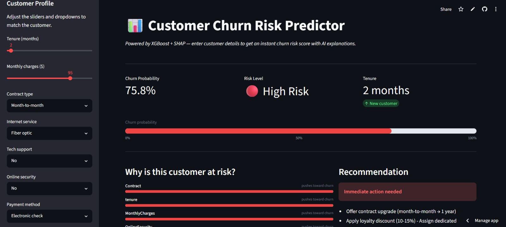
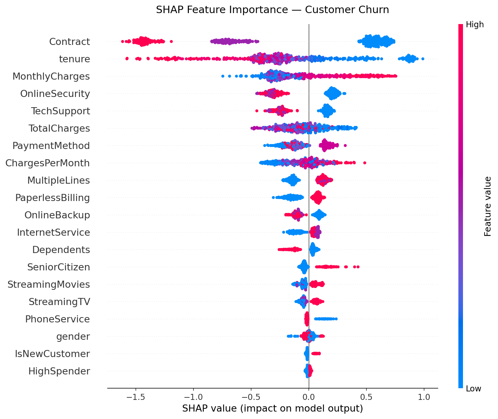
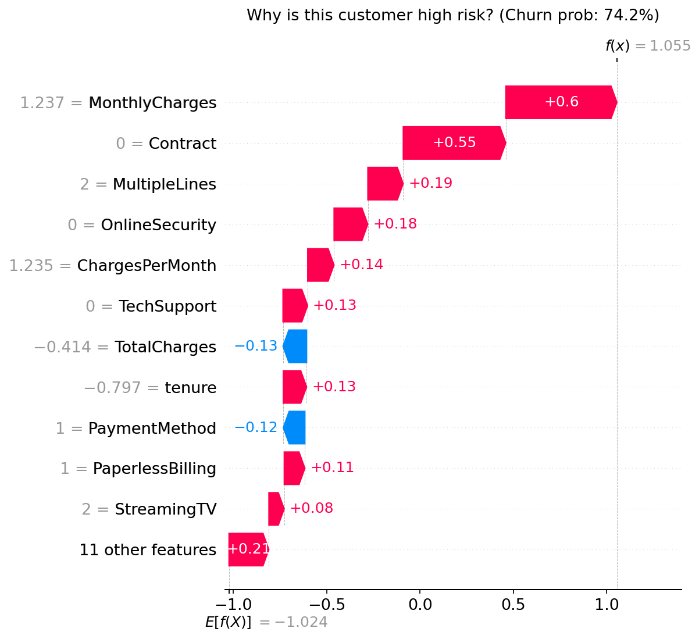

# Customer Churn Prediction

> End-to-end ML system predicting telecom customer churn  
> **CV AUC-ROC: 0.845** | XGBoost + SHAP + FastAPI + Streamlit

[](https://customer-churn-prediction-dazrvuydozwk3mm4m8ov9k.streamlit.app)



---

## Business problem

~27% of telecom customers churn annually, costing the industry
billions in lost revenue. This project builds a production-ready
ML system that identifies high-risk customers so retention teams
can act proactively — reducing churn by targeting the right
customers with the right offer at the right time.

---

## Live demo

| Resource | Link |
|----------|------|
| Streamlit app | [customer-churn-prediction-dazrvuydozwk3mm4m8ov9k.streamlit.app](https://customer-churn-prediction-dazrvuydozwk3mm4m8ov9k.streamlit.app) |
| GitHub repo | [github.com/Efrrowini/customer-churn-prediction](https://github.com/Efrrowini/customer-churn-prediction) |

---

## Results

| Metric | Score |
|--------|-------|
| CV AUC-ROC (5-fold) | **0.845** |
| Test AUC-ROC | 0.835 |
| Precision | 0.642 |
| Recall | 0.537 |
| F1-score | 0.585 |

---

## Key findings from EDA

- Month-to-month customers churn at **42%** vs 11% for 2-year contracts
- Fiber optic users are **2x more likely** to churn despite higher bills
- Customers without tech support churn at **41%** vs 15% with support
- New customers (tenure under 3 months) are the highest risk segment

---

## SHAP explainability

Global feature importance — top churn drivers:



Per-customer explanation — why one high-risk customer is flagged:



---

## Architecture

```
Raw CSV
  -> EDA (notebooks/01_eda.ipynb)
  -> Feature engineering (src/preprocess.py)
  -> sklearn Pipeline + XGBoost (src/train.py)
  -> MLflow experiment tracking
  -> SHAP explainability (notebooks/03_shap_analysis.ipynb)
  -> FastAPI endpoint (api/main.py)
  -> Streamlit demo (app/streamlit_app.py)
```

---

## Tech stack

| Layer | Tools |
|-------|-------|
| Data | pandas, numpy |
| Modelling | scikit-learn, XGBoost |
| Explainability | SHAP |
| Experiment tracking | MLflow |
| API | FastAPI, Pydantic, uvicorn |
| Frontend | Streamlit |
| Deployment | Streamlit Cloud |
| Version control | Git, GitHub |

---

## Project structure

```
customer-churn-prediction/
├── data/raw/                  # original CSV (gitignored)
├── data/processed/            # train/test splits (gitignored)
├── notebooks/
│   ├── 01_eda.ipynb           # exploratory analysis
│   ├── 02_modeling.ipynb      # pipeline verification
│   └── 03_shap_analysis.ipynb # explainability
├── src/
│   ├── preprocess.py          # feature engineering
│   └── train.py               # pipeline + MLflow
├── api/
│   ├── main.py                # FastAPI app
│   └── schemas.py             # Pydantic models
├── app/
│   └── streamlit_app.py       # demo UI
├── models/                    # saved pipeline artifact
├── reports/                   # plots and screenshots
├── requirements.txt
└── README.md
```

---

## Run locally

```bash
git clone https://github.com/Efrrowini/customer-churn-prediction
cd customer-churn-prediction
python -m venv venv
venv\Scripts\activate        # Windows
pip install -r requirements.txt

# Train model
python -m src.train

# Run Streamlit app
streamlit run app/streamlit_app.py

# Run API
uvicorn api.main:app --reload
# then open http://localhost:8000/docs
```

---

## Dataset

IBM Telco Customer Churn dataset — 7,032 customers, 21 features, binary target.  
Available on [Kaggle](https://www.kaggle.com/datasets/blastchar/telco-customer-churn).

---

*Built by Efro | Presidency University Bangalore | Data Science Portfolio*